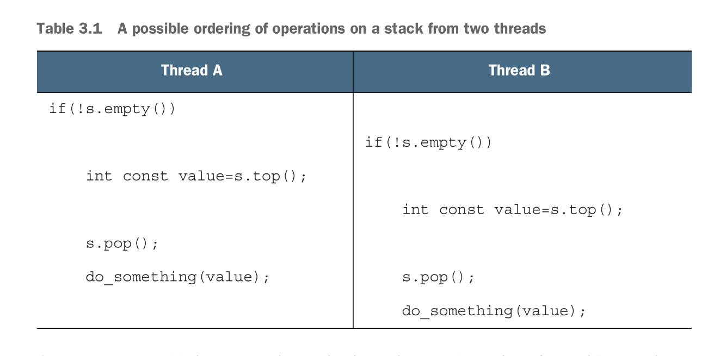

## The problems that come with sharing data in threads
If threads share data with only read only access, logically they shouldn’t be an issue in a concurrent program, because the value of the data being accessed is consistent and its integrity or *invariant* never wanes, But in the case of modifiable data, issues like data races, deadlocks, potentially corruptible data structures and such start become a concern, This is because concurrent actions might try accessing and modifying a storage at the same time, when this happens one of them in the process of exacting its change might leave the storage in a vulnerable state, while the storage is in this state any other thread trying to “perform” on this storage might lead to disastrous outcomes.

An example was given in the text on what could happen when 2 threads, try to access a node in linked list, when ones action is to delete a node and in that process leaves the data structure in a vulnerable state that was unfortunately accessed by another thread. This is known as a **race condition**

## How we could avoid race conditions
There are several ways to prevent race conditions, one way is to encapsulate the access of an data structure by constraining the access to the structure to one thread at a time, Only the thread accessing the data structure at that moment, while performing whatever modification, can see the broken invariant state of structure as it tries to perform on it, access will be released to other threads when the current operating thread is done. This is achieved via mutexes

Another approach is *lock free programming* it will be discussed in chapter 7. 

Finally the last discussed approach is creating a log in where all modification needed to be performed on the data structures is compiled in them committed at once to the data structure. The log is known as a *transaction*, just like transactions in databases; it’s main idea is doing something in private and the committing the action later at once. This approach is also known as *software transactional memory (STM)*.

## Protecting shared data with mutexes
A mutex, or intuitively, a *mutual exclusion* object, is a construct in C++ that limits the access of particular section of code to one thread at a given time. Usage of mutexes are what they call a “gentleman’s agreement” meaning the developer is responsible that that code he writes abides by capturing and locking a mutex for some specific section of the code in order to access that section, if this “gentleman’s agreement” is not adhered to; there’s not much a mutex can do.

When a thread acquires a mutex only it can access the section of the code the mutex guards and other threads wanting to access that section would have to wait for the victor thread to complete before its can then try to capture and lock the mutex to access that section of code. It is basically a synchronization primitive.

When we lock a mutex, access the code it locks and done with our intentions, its is our duty to unlock the mutex for other threads to also gain access. Although mutexes help prevent race conditions to a degree, it is not a panacea, there are other issues that come with unwise usage of mutexes, issues like deadlocks and racelocks (i think?)

A generic usage of mutexes:
```c++
#include <list>
#include <mutex>
#include <algorithm>

std::list<int> some_list;
std::mutex some_mutex;

void add_to_list(int new_value)
{
	std::scoped_lock guard(some_mutex);
	some_list.push_back(new_value);
}
bool list_contains(int value_to_find)
{
	std::scoped_lock guard(some_mutex);
	return std::find(some_list.begin(), some_list.end(), value_to_find)
		!= some_list.end();
}
```
We can further localize the access of the list by encapsulating the list in a class that enforces that access to the actual list and its properties requires it’s mutex to be locked internally implicitly. 

As stated earlier, unwise usage of mutexes will prove that its not a panacea. If any code that locks the mutex stores a reference or pointer to the list that, somehow, spawns a process that access the list via the reference or pointer, we would be as vulnerable to race conditions as we would be if we never used a mutex. Hence mutexes should be used carefully juxtaposed with careful design of the interface the data structure the mutex is protecting.

There for properly using mutexes entails careful design ensuring the mutex is locked before access to protected data **and** there are no backdoors.

## Structuring code for protecting shared data
An example was given in which two threads access protected data via acquiring a mutex, but one of them stores a pointer to that protected data in a variable and then spawns a rogue thread that possess untethered access to the protected data without a mutex by directly accessing the data via the stored pointer, This situation would most likely lead to a race condition. This example illustrates how unwise code structuring can make the benefits mutexes offer become completely pointless.

A guideline was given that can help structure code better to mitigate this problem:
*Don’t pass pointers and references to protected data outside the scope of the lock, whether by returning them from a function, storing them in externally visible memory, or passing them as arguments to user supplied functions*.

## Spotting race conditions inherent in interfaces.
Sometimes the interface of the data we are trying to protect with a mutex, inherently and implicitly impose situations where race conditions can happen even when properly accessed by a designated mutex, This is due to subtle effects handles in the data’s interface interact with each other and depend on each other. This dependence can be so crazily subtle that even two threads trying to access the same data while being locked efficiently, can produce unwanted results due to how, a handle in one thread unconsciously affected another handle in the other thread running imperceptibly close to the first in concurrency (and their closeness in execution might not even be a factor).

An example was illustrated via harmless looking stack object, but with close investigation we can see that a problem clearly exists:



As we can see in this order of execution(given that the access via a mutex are localized via its member functions or as i am phrasing them—“handles“), the `s.top()` handle execution in the first thread affects the same handle executions “integrity” in the second threads, same with the `s.pop()` in both threads. Now we have an element in the stack in which its value is process twice in both threads, and another element in which its value is never processed and completely discarded.

Here we see how one handles execution can affect the integrity of the other handles execution in a separate thread due to how closely dependent does handles are in the interface of the data being dealt with.

This race condition is abhorrently stealthy making very frustrating and dangerous to have to deal with. Other issues where also pointed out, If they arise in the course of your life Felix, re-read the book or the specific section (this is a summary, control yourself man).

This issue can be dealt with by analysing the handles the interface provides, and merging very dependent handles together into as single handle in such a way that race conditions in multiple threads becomes implausible, basically re-designing the data structures interface.

some issues could also occur like:
if `pop()` was designed to modify the stack first, then return the value popped to be copied, in a situation where computational resources like memory is very limited or completely exhausted, when copying from a stack like `stack<vector<int>>`, the `vector<int>` object being copied to due to lack of memory might throw an `std::bad_alloc` prompting the copy to fail, leaving the stack already modified, and the “was-to-be-popped” value irretrievably discarded. Thankfully the designers of `std::stack` interface seperated the intention of copying and modifying the `std::stack`, via `top()` and `pop()`. We call `top()` to copy an item from the stack and if its unsuccessful the stack is left unmodified and we know its a heap problem (meaning space would need to be freed), then once copy is successful we can call `pop()` to discard the element. 

But it’s the interrelation between `top()` and `pop()` being separate handles that effect each other that was causing our race condition.

Fortunately there are alternatives, though they aren’t without their cost:
* Passing a reference of the variable we want to `pop()` an element, this posses some limitations and resource overhead though.
* require a no-throw copy constructor or move constructor
* returning a pointer to the popped item; The advantage here’s is pointers can be freely copied without throwing an exception, an `std::shared_ptr` would prove extremely useful in this case, since the object would only be deleted when the last pointer to the object is deleted.

### Class definition for a thread-safe stack
```c++
#include <exception>
#include <memory>

struct empty_stack : std::exception 
{
	const char* what() const noexcept;
};

template <typename T>
class threadsafe_stack 
{
public:
	threadsafe_stack();
	threadsafe_stack(const threadsafe_stack&);
	threadsafe_stack& operator=(const threadsafe_stack&) = delete;
	void push(T new_value);
	std::shared_ptr<T> pop();
	void pop(T& store);
	bool empty() const;
}
```
By pairing down operations we allow for maximum safety and the stack itself cannot be reassigned due to use deleting the line three in the public scope.

Fleshed out class definiation of thread-safe stack:
```c++
#include <memory>
#include <exception>
#include <stack>
#include <mutex>

struct empty_stack : std::exception
{
	const char* what() const throw();
};

template <typename T>
class threadsafe_stack {
private:
	std::stack<T> t_stack;
	mutable std::mutex m_stack;
public:
	threadsafe_stack() {}
	threadsafe_stack(const threadsafe_stack& other) {
		std::scoped_lock guard (m_stack);
		t_stack = other.t_stack;
	}
	threadsafe_stack& operator=(const threadsafe_stack&) = delete;
	void push(T new_value) {
		std::scoped_lock guard (m_stack);
		t_stack.push(std::move(new_value));
	}
	std::shared_ptr<T> pop() {
		std::scoped_lock guard (m_stack);
		if(t_stack.empty()) throw empty_stack{};
		const std::shared_ptr<T> res {std::make_shared<T>(t_stack.top())};
		t_stack.pop();
		return res;
	}
	void pop(T& store) {
		std::scoped_lock guard (m_stack);
		if (t_stack.empty()) throw empty_stack{};
		store= t_stack.top();
		t_stack.pop();
	}
	bool empty const {
		std::lock_guard lock(m_stack);
		return t_stack.empty();
	}
}
```

as we’ve seen race conditions can often happen locking in too small a granularity; the lock does not cover the entirety of the desired operation. Problem can  also arise in locking too big a granularity such that the benefits of concurrency is lost because most threads would have to wait for a thread that has gathered almost all resources they need (and locked it)  complete, This can degrade the paradigm of execution to a sequential one. This was an issued faced while designing the first iterations of the Linux kernel.

## Deadlock: The problem and solution
Deadlocks are situations in which a thread that has acquired a mutex requires a separate mutex that is being currently possessed by another thread and the latter thread also requires the lock that former already posses, this cyclically locked dependency is what creates a **deadlock** , making each threads wait for each other indefinitely.

Deadlocks are caused by locking in non-fixed order. If we always lock in an agreed upon order (always locking mutex A before mutex B, **always** where ever it might be in the code) deadlocks will never occur. Though this is not straightforward.

Thankfully C++ std provide `std::lock`, a function that locks two or more mutexes at once without risk of a deadlock; it follows an “all or nothing” philosophy, if it cannot lock even a single mutex, it unlocks all it previously had possession of and waits to try again.

A simple illustration using `std::lock` in a swap operation:
```c++
class some_big_object;
void swap(some_big_object& lhs, some_big_object& rhs);

class X 
{
private:
	some_big_object some_detail;
	std::mutex m;
public:
	X(const some_big_object& x): some_detail(x) {}
	
	friend void swap(X& lhs, X& rhs) {
		if (&lhs==&rhs) return;
		std::lock(lhs.m, rhs.m);
		std::lock_guard<std::mutex> lock_a(lhs.m, std::adopt_lock);
		std::lock_guard<std::mutex> lock_b(rhs.m, std::adopt_lock);
		swap(lhs.some_detail, rhs.some_detail);
	}
};
```
The `std::adopt_lock` here tells `lock_guard` (basically a primitive version of `scoped_lock`) that the mutex has already been locked and should not be re-locked (re-locking a locked mutex is UB) but ownership should be transferred to it so it can force the mutex to adhere to it’s semantics.
This some operation can be further simplified by using c++17 `std::scoped_lock`
```c++
friend void swap(X& lhs, X& rhs) {
	if(&lhs==&rhs) return;
	std::scoped_lock guard(lhs.m, rhs.m);
	swap(lhs.some_detail, rhs.some_detail);
}
```

## Further Guidelines for avoiding deadlocks
Deadlocks care not just limited to two threads, multiple threads can end up deadlocked, there can even be cases where threads deadlock without even having locks. The guidelines for preventing deadlocks ultimately boils down to *Don’t wait for a thread if there’s a chance it’s waiting for you*.

1. Avoid Nested Locks; do not acquire a lock if you already hold one, sticking to this guideline makes its impossible for deadlocks to occur from lock usage alone. Though if you need to acquire more than a single lock, perform the acquiring all locks as a single act via `std::lock`/`std::scoped_lock`
2. Avoid calling user supplied code while holding a lock; You have no idea what user supplied code could do; even holding a lock which cold lead to nested locks and result to a deadlock.
3. Acquire locks in a fixed order: If you must absolutely acquire more than one lock, we should perform the acquisition via `std::lock` or its relatives, if we don’t follow that approach, the next bets thing is to acquire the locks in the same order in **every** thread. This is not so simple though, and dependent on the operation you want to perform special analyses must be taken to include extra measures to prevent deadlock that would most likely arise.
4. Use a lock hierarchy: lock hierarchies enforce that we lock threads in a specific order at runtime, The idea is we divide section of an application into layers while identifying all the mutexes that would need to be locked for a layer. Now if a code tries to lock a mutex it won’t be permitted to do so if it already holds a lock from a lower layer. This constraint enforces a strict order for mutexes to be locked by and imposes restrictions on lower layer code from accessing higher layer code.
```c++
hierarchical_mutex high_level_mutex (10'000);
hierarchical_mutex low_level_mutex (5000);
hierarchical_mutex other_mutex(6000);

void do_low_level_stuff();
void low_level_func() 
{
	std::scoped_lock lk (low_level_mutex);
	do_low_level_stuff();
}

void do_high_level_stuff();
void high_level_func();
{
	std::scoped_lock lk (high_level_mutex);
	do_high_level_stuff();
}

void thread_a()
{
	high_level_func();
}

void do_other_stuff();
void other_stuff()
{                                               | VIOLATION OF
	high_level_func();                          | HIERARCHICAL ORDER. 
	do_other_stuff();                           | -------------------
}                                               | other_stuff invokes
void thread_b()                                 | high_level_func which
{                                               | locks high_level_mutex
	std::scoped_lock lk (low_level_mutex);      | below low_level_mutex
	other_stuff(); <----------------------------+
}
```
Hierarchical mutexes make deadlocks impossible because the locks themselves enforce the locking order. Its no part of the standard but this is a sufficient implementation:
```c++
// a simple hierarchical mutex

class hierarchical_mutex
{
	std::mutex internal_mutex;
	const unsigned long hierarchy_value;
	const unsigned long previous_value;
	static thread_local unsigned long this_thread_value;
	void check_for_violation()
	{
		if (this_thread_value <= hierarchy_value)
			throw std::logic_error("mutex hierarchy violated");
	}
	void update_hierarchy_value()
	{
		previous_value=this_thread_value;
		this_thread_value=hierarchy_value;
	}
public:
	explicit hierarchical_mutex(unsigned long value):
		hierarachy_value(value),
		previous_value(0)
	{}
	void lock()
	{
		check_for_violation();
		internal_mutex.lock();
		update_hierarchy_value();
	}
	void unlock()
	{
		if (hierarchy_value != this_thread_value)
			throw std::logic_error("mutex hierarchy violated")
		this_thread_value=previous_value;
		internal_mutex.unlock();
	}
	bool try_look()
	{
		check_for_violation();
		if(!internal_mutex.try_lock())
			return false;
		update_hierarchy_value();
		return true;
	}
};
using ul = unsigned long;
thread_local ul hierarchical_mutex::this_thread_value(ULONG_MAX);
```
Three methods are needed to satisfy a mutex concept, `lock` , `unlock` , `try_lock`. `try_lock` checks if the mutex is available to be locked, if available it locks it and returns true, if its not available it simply returns false instead of waiting for when it would be available, thereby not blocking the chain of execution of the thread that called it. 

## Flexible locking with `std::unique_lock`
`std::unique_lock` offers a bit more flexibility than other locks, Sometimes, it doesn’t even own its locks, A mutex can be passed into it that we wish to own at another point in time, it allows the input of behavioral flags like, `std::adopt_lock`, that tells `std::unique_lock` not to re-lock the mutex only to possess ownership, and, a unique flag, `std::defer_lock` which prompts `std::unique_lock` to defer it’s lock and ownership, upon construction, to another time when `lock()` is called on the `std::unique_lock` instance (not the mutex). `std::unique_lock` offers flexibility as acting simultaneously as a lock and a mutex (in a way), but this flexibility does not exist without expenses, `std::unique_lock` takes more space and is slightly slower than `std::lock_guard` due to its having to store and manage extra states.
```c++
friend void swap(X& lhs, X& rhs)
{
	if(&lhs==&rhs)
		return;
	std::unique_lock lock_a(lhs.m, std::defer_lock);
	std::unique_lock lock_b(rhs.m, std::defer_lock);
	std::lock(lock_a, lock_b);
	swap(lhs.some_detail, rhs.some_detail)
}
```
`std::lock`, could be called on a `std::unique_lock`, like a mutex would because its satisfies a lock (mutex) concept.
A flag is stored in the `unique_lock` object to determine if the mutex is currently owned by that instance, This is important because its dictates the behavior of `std::unique_lock`, if it does posses ownership then its destructor *must call* `unlock()`, if it does not its *must not*.

`unique_lock` is useful in cases we want deferred ownership, or the ability to transfer mutex from one scope to another.

## Transferring mutex between scopes
`std::unique_lock` is movable but **not** copy-able, so it’s instance, along with its ownership, can  be moved from one scope to another. This move can be implicit (interacting with rvalue), or explicit (interacting with lvalues).

One possible use is for a called function to acquire a mutex, perform some operations then return the transfer ownership of the mutex to the caller for additional processing once the invoked function returns:
```c++
std::unique_lock get_lock()
{
	extern std::mutex some_mutex;
	std::unique_lock lk (some_mutex);
	prepare_data();
	return lk;
}
void process_data()
{
	std::unique_lock lk (get_lock());
	do_something();
}
```
The flexibility of `std::unique_lock`  allows instances to relinquish their locks before they are destroyed. This makes it useful for gateway classes to an actual data-structure, if the gateway class is move-able, as its `std::unique_lock` member data field, then it can be passed around scopes transferring ownership to chain discrete operations with the goal to perform a singular grand operation.

## Locking at an appropriate granularity
Granularity is the how much or how less of a data structure or an operation, in its entirety, a lock constrains to its owner. fine-grained granularity protects small amount of data, coarse-grained protects a large amount of data. 

Coarse granularity can most of the time lapse the benefits the come with concurrency by degrading the sequence of execution from a concurrent one to a pseudo-concurrent one that mostly resembles a sequential process. Because of this we should always opt to use fine-grained granularity wherever possible. 

`std::unique_lock` helps in fine-graining granularity because we can chose to `unlock()` whenever we aren’t currently using the data and `lock()` back whenever we want access again:
```c++
void get_and_process_data()
{
	std::unique_lock my_lock (some_mutex);
	some_class data_to_process = get_next_data_chunk();
	my_lock.unlock(); //---> other threads can now access.
	result_type result = process(data_to_process);
	my_lock.lock();  //----> relock mutex to write result.
	write_result(data_to_process, result);
}
```
This examples shows, granularity isn't only about the amount of data locked; it is also about how long the long is held and what operations are performed while the lock is held. *In general, a lock should be held for only the minimum possible time needed to perform the required operations*.

A lock should not be held while perform expensive operations like waiting for I/O unless absolutely necessary.

## Alternative facilities for protecting shared data
Some situations require more effective solution than whatever had been discussed till this point, situations like protecting shared data during only initialization maybe because after construction the data is read only and concurrent access is not an issue, or, protecting rarely updated data structures by granting one one thread exclusive write access to update and see the structure in its broken state as it commits changes, and a mechanism to allow plebeian read access to other threads.

## Protecting shared data during Initialization
Suppose we have a shared resource that is expensive to construct so much so that we want to doe so only if required. *Lazy initialization* proves to be sufficent in single threaded code:
```c++
std::shared_ptr<some_resource> resource_ptr;
void foo()
{
	if(!resource_ptr)
	{
		resource_ptr.reset(new some_resource);
	}
	resource_ptr->do_something();
}
```
But in multi-threaded code, this can cause serialization where only the first thread constructs the the resource and performs while leaving the other threads serialized waiting to perform an already performed task only to wait for nothing (because construction has already be achieved). This serialization makes threads perform redundant operations that still end in futility in a sequential manner:
```c++
std::shared_ptr<some_resource> resource_ptr;
std::mutex resources_mutex;


void foo()                                   serialization happens here  
{                                                             |     
	std::unique_lock<std::mutex> lock (resource_mutex); <-----+
	if(!resource_ptr)
	{
		resource_ptr.reset(new some_resource);
	}
	lock.unlock();
	resource_ptr->do_something();
}
```
Although this is thread safe and works, serialization destroys the benefit of concurrency

some cleverly cooked recipes for disasters have been crafted in the past to deal with this issue, but still fall short due to insidiously introducing a race condition known as *data race*, like the infamous *double-checked locking pattern*.

Luckily the C++ standard saw this an important issue and provided `std::once_flag` and `std::call_once` to handle the situation.

In this case any thread can safely call `std::call_once`, with the knowledge that pointer wold have been initialized by some thread (in a properly synchronized manner) by the time `std::call_once` exits, The synchronization data is stored in `std::once_flag`, each instance of `once_flag` corresponds to a different initialization. `std::call_once` subjects the code to less overhead than using mutexes explicitly, especially when the initialization has already been done, so it should be preferred wherever the need arises:
```c++
std::shared_ptr<some_resource> resource_ptr;
std::once_flag resource_flag;

void init_resource()
{
	resource_ptr.reset(new some_resource); 
}                                                       | Initialization
void foo()                                              | is called  
{                                                       | exactly once. 
	std::call_once(resource_flag, init_resource); <-----+ 
	resource_ptr->do_something();
}
```

An example for some form of connection:
```c++
class Session
{
	connection_info connection_details;
	connection_handle connection;
	std::once_flag connection_init;
	void open_connection()
	{
		connection=connection_manager.open(connection_details);
	}
public:
	X(connection details const& connection_details_):
		connection_details(connection_details_)
	{}
	void send_data(data_packet const& data)
	{
		std::call_once(connection_init, &Session::open_connection, this);
		connection.send_data(data);
	}
	data_packet recieve_data()
	{
		std::call_once(connection_init, &Session::open_connection, this);
		return connection.recieve_data();
	}
};
```
In this example, initialization is either done by the first call to `send_data()` or by the first call to `recieve_data()`.

`std::mutex` and `std::once_flag` instances can’t be copied or moved.

`static`keyword can be used to achieve similar results as `std::call_once` in post c++11 compilers (c++11 compiler included), compilers before this era would pose an issue:
```c++
class my_class;
my_class& get_my_class_instance()   | Initialization guaranteed
{                                   | to be thread-safe.
	static my_class instance; <-----+
	return instance;
}
```
This is because pre c++11 compilers, every thread believes they are the first to declare the static object so a race condition to initialize first occurs. C++11 compilers fix this that making only one thread complete the initialization while blocking others.

Protecting data only for initialization is a special case for a more special general scenario: data structures which are read-only most of the time and, rarely, need an update.

## Protecting rarely updated data structures.
In cases when we wish to thread safe rarely updated data structure with a read-writer mechanism in which writer threads (usually singular) are granted exclusive writer privileges to write/update the thread while blocking other threads from possibly viewing the data structure in a broken state, While reader threads posses concurrent access to the data structure, we use *read-writer mutex*. 

`std::mutex` to protect data in such cases is usually inefficient, since it has no mechanisms to support our wishes, it will simply degrade read access to a sequential process and offer no support for exclusive access to the writer, it’ll just be treated as a normie thread that would also be degraded to execute sequentially.

C++17 offers mutexes to achieve this reader-writer relationship, such mutexes allow two different kinds of usage: exclusive access by a single “writer” thread or shared/concurrent access by multiple “reader” threads.

These mutexes are `std::shared_mutex` and `std::shared_time_mutex`, the difference between them is that `shared_time_mutex` supports additional operations which logically would come with extra overhead, if we don’t need does operations `std::shared_mutex` might offer performance benefits.

* **For update operations**: `std::lock_guard<std::shared_mutex>` and `std::unique::shared_mutex` can be used for the locking in place of the corresponding `std::mutex` specializations. 
* **For reading threads**:  `std::shared_lock<std::shared_mutex>` help the reader threads obtain *shared access*.

`std::shared_lock` behaves like `std::unique_lock` except multiple threads may have a shared lock on the same `std::shared:mutex` at the same time.

The only constraint in this approach is that of a thread has a shared lock, an exclusive thread that tries to acquire the thread will be blocked until the last thread with the shared lock relinquishes its lock. Likewise, if an exclusive lock posses a shared lock, no other thread may acquire shared or exclusive lock until the first thread relinquish its lock.

an example of protecting a data structure with `std::shared_mutex`:
```c++
#include <shared_mutex>
#include <map>
#include <string>
#include <mutex>
/**/                            exclusive-write-access(single thread)-+
/**/                       concurrent-read-access(multiple threads)-+ |
class dns_entry;                                                    | |
class dns_cache                                                     | |  
{                                                                   | |
	std::map<std::string, dns_entry> entries;                       | |
	mutable std::shared_mutex entry_mutex;                          | |
public:                                                             | |
	dns_entry find entry(std::string const& domain) const           | |
	{                                                               | |
		std::shared_lock lock (entry_mutex); <----------------------+ |
		std::map<std::string, dns_entry>::const_iterator const it =   |
			entries.find(domain);                                     |
		return (it==entries.end())?dns_entry{}:it->second;            |
	}                                                                 |
	void update_or_add_entry(std::string const& domain,               |
		dns_entry const& entry)                                       |
	{                                                                 |
		std::scoped_lock<std::shared_mutex> lock (entry_mutex); <-----+
		entries[domain]=entry;
	}
};
```

## Recursive Locking
`std::mutex` results in an error when threads try to lock a mutex of its type when it already owns that specific mutex. This can be resolved by using `std::recursive_mutex`, `std::recurisive_mutex`, allows a thread to lock the same mutex more then once while it already owns the mutex, this can seem helpful in situations where a class is protected by a mutex but it’s access is fine grained by member functions locking the mutex to perform a specific option (making other threads access other operations concurrently), but in this scenario the member function being called requires calling another member function that locks the same mutex,  using `std::mutex` results to undefined behavior, but `std::recursive_mutex`, makes this approach possible. 

In most cases recursive mutex is not that desirable solution we think we seek, if we face situations that we think we need a recursive mutex, there most likely exist a design issue.