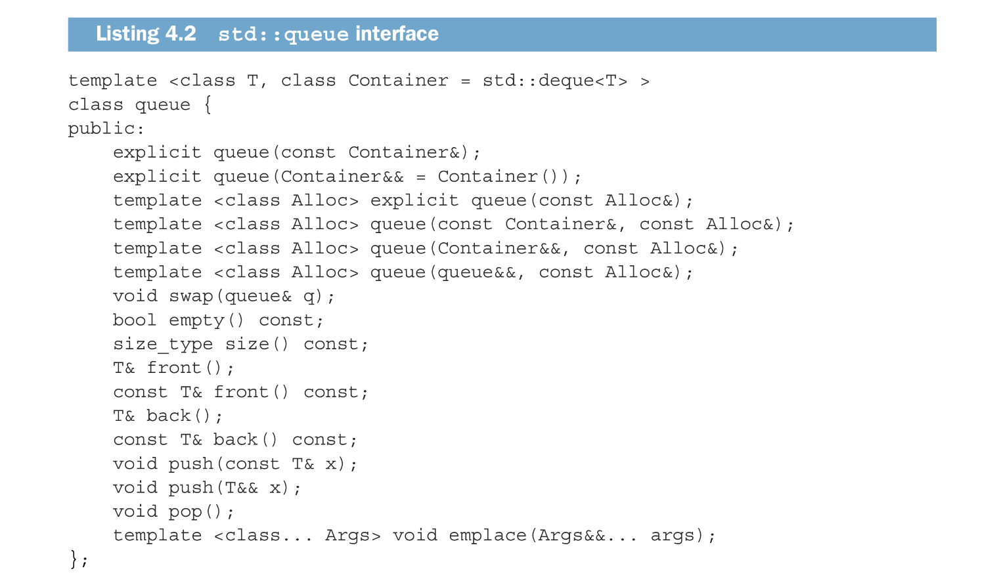
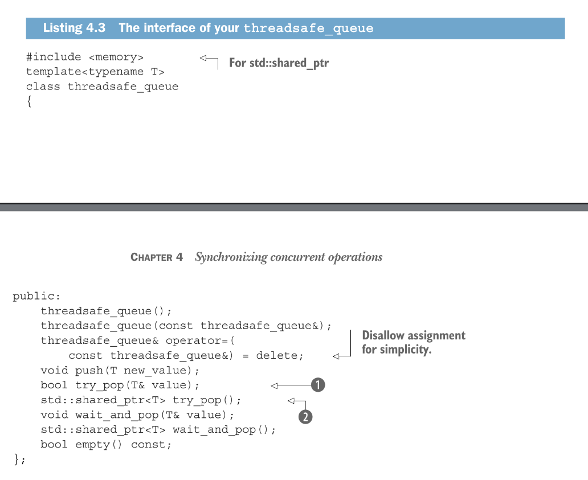

Sometimes threads need to wait for another thread to perform a specific operation, C++ provides mechanism for the synchronization of threads to perform aggregate actions via *conditional variables* and *futures*.

This chapter explains synchronization in concurrent programming

## Waiting for an event or other condition
A thread might require another thread to accomplish some operation on a shared data before it itself can complete it’s own operation, To synchronize this action we might require the we could make the waiting thread keep checking a “completed” flag in the shared data (protected by a mutex), to see if the waited'-for thread has completed its required action and updated the flag to signal it has completed its action, the issue with this is that waited on thread continuously consumes valuable resources (that could be beneficial to the waited-for thread) on the trivial task that is “checking” and possibly when the waiting thread locks the mutex of the shared data, the waited-for thread cannot access the shared data to update the flag for completed, if it does completes its task; what can we do here? a solution can be to limit the frequency (by a some time value) in which the waiting thread actually checks the completed flag, this can be done by making the waiting thread sleep for some amount for time in-between each successive checks:
```c++
bool completed_flag;
std::mutex m;

void do_something();
void check_if_completed_then_do_something()
{
	std::unique_lock lk (m);
	while(!flag){
		lk.unlock();
		std::this_thread::sleep_for(std::chrono::milliseconds(100));
		lk.lock();
	}
	do_something();
}
```
Although this is an improvement from making the thread zombie-shly check the flag continuously, getting an adequate timing can prove to be tricky, Luckily C++ provides  *conditional variables* to battle this

## Conditional variable mechanism
Conceptually, a conditional variable is associated to an event or some condition and one or more threads can wait for that condition to be satisfied, then once the thread modifying the event completes the waited-for event it can now notify the threads waiting on the conditional variable prompting them to wake up and continue their processing.

## Waiting for a condition with condition variables
C++ standard offers two implementation of a conditional variable; `std::conditional_variable` and `std::conditional_variable_any`, the former exclusive operates with the generic `std::mutex` , while the other works with whatever construct that satisfies the mutex concept, hence heavier in size and poses more computational overhead compared to it’s former.

`std::conditional_variable` should always be preferred except where additional flexibility is required, Below is an example with it:
```c++
std::queue<data_chunk> data_queue;
std::mutex m;
std::conditional_variable cond;

void data_preparation_thread()
{
	const data_chunk data=prepare_data();
	{
		std::scoped_lock lk(mutex);
		data_queue.push(data);
	}
	cond.notify_one();
}

void data_processing_thread()
{
	while(true)
	{
		std::unique_lock<std::mutex> lk (m);
		cond.wait(lk, []{ return !data_queue.empty(); });
		data_chunk data = data_queue.front();
		data_queue.pop();
		lk.unlock();
		process(data);
		if(is_last_chunk(data)) break;
	}
}
```
In this code, the `data_queue` is used as a means of relay between the preparation thread and the processing thread, now when a data chunk is successfully prepared, the preparation thread relinquishes its lock and threads waiting via the conditionally variables are notified via `cond.notify_one()`.

Say now a processing thread acquires the lock to the queue before the preparation thread could prepare any data for it process, the `cond.wait()` conditional variable member function checks if the predicate passed into it is `true`, if its not it takes the lock passed into it, unlocks it (which explains why `std::unique_lock`) and its chain of execution is blocked—waiting, now lets say the preparation thread was able to acquire the lock, it prepares the data, loses the lock and then `cond.notify_one()` is invoked. This wakes the previously waiting threads for processing. They acquire the lock, `cond.wait()` evaluates its predicate and sees its `true`, `lk` is left untouched (still locked) and its processing commences, with unlocking wherever necessary.


The flexibility of `std::unique_lock` in the processing thread allows us in situations when we have data to process, to relinquish “the lock” so we don’t process the data, which could be time consuming, while holding a lock.

## Building a thread-safe queue with conditional variables
When building a container like a queue that will be subjected to concurrent operations, we need to make it thread-safe, A way of designing the container to be thread safe is making the interface of the actual container simpler in such a way that a handle that could effect the desired output of another handle running on a separate thread are safe from each other.

We can achieve this by merging such handles to a single handle, so that single handle takes account of the effects of both individual handles and manages them in a single coherent state that checkmates each other to ensure and enforce the desired output is gotten.

Also not so important handles that could affect the desired concurrent operation of the container should be `=delete`d or discarded from the implementation.


for example: the `std::queue` interface could be streamlined from:



if we can ignore the construction, assignment and swap operations, we notice we are left with three groups of main operations:
* Those than query the state of the whole queue (`empty()` and `size()`)
* Those that query the elements of the queue (`front()` and `back()`)
* And those that modify the queue (`push()`, `pop()` and `emplace()`)

now these handles individually can prove cumbersome in concurrent program—threatening insidious race conditions, but we can eliminate this by merging similar handles and discarding counter-productive handles

Though when using a thread to pass shared data, the receiving thread usually needs to wait for data so we provide 2 variants of `pop()`:
* `try_pop()`; this tries to pop and always return a boolean to indicate failure or success.
* `wait_and_pop()`: if the queue is empty; waits for the queue not to be empty so it can execute a successful `pop()`.

The interface would be streamlined to resemble this:



The implementation:
```c++
#include <memory>
#include <mutex>
#include <condition_variable>
#include <queue>

template <typename T>
class threadsafe_queue
{
private:
	mutable std::mutex m;
	std::queue<T> safe_queue;
	std::condition_variable cond;
public:
	threadsafe_queue() {}
	threadsafe_queue(const threadsafe_queue& other)
	{
		std::scoped_lock lk (m);
		safe_queue=other.safe_queue;
	}
	threadsafe_queue& operator=(const threadsafe_queue& other)=delete;

	void push(T new_value)
	{
		std::scoped_lock lk (m);
		safe_queue.push(new_value);
		cond.notify_one();
	}
	bool try_pop(T& value)
	{
		std::scoped_lock lk (m);
		if (safe_queue.empty()) return false;
		value=safe_queue.front();
		safe_queue.pop();
		return true;
	}
	std::shared<T> try_pop()
	{
		std::scoped_lock lk (m);
		if(safe_queue.empty()) return nullptr;
		std::shared_ptr<T> res (std::make_shared<T>(safe_queue.front()));
		safe_queue.pop();
		return res;
	}
	void wait_and_pop(T& value)
	{
		std::unique_lock lk (m);
		cond.wait(lk, []{ return !safe_queue.empty(); });
		value=safe_queue.front();
		safe_queue.pop();
	}
	std::shared_ptr<T> wait_and_pop()
	{
		std::unique_lock lk (m);
		cond.wait(lk, []{ return !safe_queue.empty(); });
		std::shared_ptr<T> res (std::make_shared<T>(safe_queue.front()));
		safe_queue.pop();
		return res;
	}
	bool empty() const
	{
		std::scoped_lock lk (m);
		return safe_thread.empty();
	}
};
```

## Waiting for one-off events with futures
When waiting for one of events; events that only occur once, this kind of event is modeled, and handled, in c++ via *futures*.

C++ models this kind of concept with a future that represents an event that a thread is to wait for, an event that will occur concurrently as the thread waits for this future. The thread therefor is free to perform any other tasks it might want to.

There are two sorts for future in the `<future>` header; they are:
1) unique futures `std::future<>` and,
2) shared futures `std::unique_future<>`
They are modeled after `std::unique_ptr` and `std::shared_ptr`.

An `std::future` is the one and only future that is associated with an event, it is unique.

Whilst multiple instances of `std::shared_future` may refer to the same event, in his case all futures will become ready at the same time, and may all access any data associated with the event.

the template parameter is the type of the associated data, this is also the reason why futures are templates. `std::shared_future<void>` and `std::future<void>` should be used when there is no associated data

although futures themselves are used to communicate within threads they do no provide any support for synchronized access inherently, if multiple threads wish to access a single future is best that future is guided by some mutex or some synchronization mechanism.

The Concurrency TS  provides extended versions of the class templates with added functionalities, these versions are provided by the `std::experimental` namespace:
1) `std::experimental::future<>` and, 
2) `std::experimental::shared_future<>`.
They behave identical to their logical counterparts but with added functionalities as mentioned earlier.

to include these classes one must include the `<experimental/future>` header; there is no difference in code quality or any risk of  “quirkiness” of any sort while using `experimental` code; they just require unorthodox ways to implement with their own novel semantics.

### Returning values from background tasks
We can use futures to secure the result of a computation that is being ran by some thread running in the background.

One way we can achieve this is by using an `std::async` object, this object takes in the task to be computed and instead of blocking the invoking thread (in order to wait for the result) it returns a future that is to hold the computed result from the background thread once the result is ready. 

The invoking thread upon receiving the future; performs whatever tasks it wishes to then whenever it requires the result of the background ran computation; it calls`.get()`  on the future; which then blocks the execution of the invoking thread to retrieve the result of the background compute.

an example:
```c++
#include <future>
#include <iostream>

int answer_to_ltuae()
void do_other_stuff()

int main()
{
	std::future<int> answer = std::async(answer_to_ltuae);
	do_other_stuff();
	std::cout << answer.get(); 
}
```
An example that shows how to pass arguments to `std::async` since the task that it is to run requires them, `std::async` allows only move only types as arguments.:
```c++
#include <string>
#include <future>
struct X
{
	void foo(int, std::string const&);
	std::string bar(std::string const&);
};
X x;

// calls p->foo(42, "hello") where p is &x
auto f1 = std::async(&X::foo, &x, 42, "hello")
// creates a temp object copy of x and the inbokes bar()
auto f2 = std::async(&X::bar, x, "goodbye");
struct Y
{
	double operator()(double);
};
Y y;
// creates a temp object which then moved into async's domain for
// thread execution.
auto f3 = std::async(Y(), 3.141);
auto f4 = std::async(std::ref(y), 2.718); // calls y(2.718)
X baz(X&);
std::async(baz, std::ref(x));
class move_only 
{
public:
	move_only();
	move_only(move_only&&);
	move_only(const move_only&) = delete;
	move_only& operator=(move_only&&);
	move_only& operator=(const move_only&) = delete;
	void operator()();
};
// calls tmp() where tmp is a move constucted object from the argument
auto f5 = std::async(move_only());
```

By default it is up to implementation to choose whether an `async()` starts a new thread, or runs synchronously when the future is waited for.

This can be specified with an additional parameter, which is declared before the function to be called; the parameter is of type `std::launch`, it could be either:
1) `std::launch::deferred`; indicating that the tasks execution should be deferred until `wait()` or `get()` is invoked on the future.
2) `std::launch::async`: indicating that the task must be ran on it’s own separate thread, or 
3) `std::launch::deferred | std::launch::async`: indicating that implementation may choose.
```c++
// Runs in new thread
auto f6 = std::async(std::launch::async, Y(), 1.2);
// run in wait() ot get()
auto f7 = std::async(std::launch::deferred, baz, std::ref(x));
// implementation chooses
auto f8 = std::async(
	std::launch::async | std::launch::deferred,
	baz, std::ref(x);
)
// implementation also chooses
auto f9 = std::async(baz, std:.ref(x));
// invoked deferred function.
f7.wait()
```

### Associating a task with a future
`std::packaged_task<>` ties a future to a function or callable object.

when a packaged task object is invoked, it invokes its associated function or callable object and makes the future object *ready*, with the return value stored as it’s associated data.

This can be used as the building blocks for thread pools or other task management schemes; such as running each task on its own separate thread or running them all sequentially on a particular background thread.

if a large task can be subdivided into smaller piece those smaller pieces can be packaged into a `packaged_task` then those packaged tasks can be fed into a task scheduler or thread pool.

This creates abstractions that makes concurrent code simpler. 

The template parameter for the `packaged_task<>` template is the function signature. The function signature defines that type of function to be ran.

The return type of the specified function signature identifies the type of the of the `std::future<>` returned from the `get_future()` member function.

the callable object (or function) signature passed into a packaged task in its construction must be compatible (or match) the specified function signature declared in the packaged tasks template parameter.

### Listing 4.8 Partial class definition for a specialization of `std::packaged_task<>`
 ```c++
 template <>
 class packaged_task<std::string(std::vector<char>*, int)>
 {
	 template <typename Callable>
	 explicit packaged_task(Callable&& f);
	 std::future<std::string>  get_future();
	 void operator() (std::vector<char>*, int);
 };
 ```
 The `std::packaged_task` object is a callable object, it can be wrapped in a `std::function` object, passed to a `std::thread` as a thread function, passed to another function that requires a callable object, or even invoked directly.

when the `std::packaged_task` is initialized with a  task, as a callable object; the supplied arguments are passed into the underlying task function and the return value is stored as the asynchronous result in the `std::future`  obtained from `get_future()`.

We can thus wrap a task in a `packaged_task`, retrieve its associated future then ship the packaged task to wherever (some thread) in which its invocation will occur (in due time). When the result of the task is needed; we then wait for the future to be come ready (that’s if its not already ready)

### Passing tasks between threads
GUI application utilize packaged tasks to relay information from one GUI thread to another:
```c++
#include <deque>
#include <mutex>
#include <future>
#include <thread>
#include <utility>

std::mutex m:
std::deque<std::packaged_task<void()>> tasks;

bool gui_shutdown_message_recieved();
void get_and_process_gui_message();

void gui_thread()
{
	while(!gui_shutdown_message_recieved())
	{
		get_and_process_gui_message();
		std::packaged_task<void()> task;
		{
			std::scoped_lock lk (m);
			if(tasks.empty())
				continue;
			task = std::move(tasks.front());
			tasks.pop_front();
		}
		task();
	}
}

std::thread gui_bg_thread(gui_thread);

template <typename Func>
std::future<void> post_task_for_gui_thread(Func F)
{
	std::packaged_task<void()> task(f);
	std::future<void> res = task.get_future();
	std::scoped_lock lk (m);
	tasks.push_back(std::move(task));
	return res;
}
```

### Making (std::)promises
According to the earlier excerpt in the text, Promises behave just like futures but they help handle instances where the the task to be performed cant be expressed by a simple function call, or cases where the result may come from more than one place. I am a bit confused.

`std::promise<T>` provide means of setting a value of type `T` that can later be read through an associated `std::future<T>` object. An `std::future/std::promise` pair could offer one possible mechanism for this facility: the waiting thread could block on a future, then the writing/provider thread could use an `std::promise` to set the value of the associated future, making it ready.

You can obtain the `std::future` associated with an `std::promise` by invoking the `get_future()` member function (just like with packaged tasks). The value of the future is set by the promise via the `set_value()` member function; this enables the future *ready* state, granting it the utility of now being able to retrieve the stored value.

if a promise is destroyed without storing a value in it’s associated future; an exception is stored instead.

An example using an `std::promise<bool>/std::future<bool>` pair:
	*handling multiple connections from a single thread using promises*
```c++
#include <future>
void process_connections(connection_set& connections)
{
	while(!done(connections)) // 1
	{
		for (connection_iterator start=connections.begin(), // 2
			 connection_iterator end=connections.end(); start!=end
			 ; ++start)
		{
			if(connection->has_incoming_data()) // 3
			 {
				data_packet data=connection->incoming();
				std::promise<payload_type>& p=
					 connection->get_promise(data.id); // 4
				p.set_value(data.payload);
			 }
			 if(connection->has_outgoing_data()) // 5
			 {
				 outgoing_packet data=
					 connection->top_of_outgoing_queue;
				connection->send(data.payload);
				data.promise.set_value(true); // 6
			 }
		}
	}
}
```
Explanation:
**`1`→**  `process_connections()` function loops until `done()` returns `true`
**`2`→**  Every loop iterates through each  `connection`  in `connections` turn by turn.
**`3`→**  Retrieves incoming data if any 
**`5`→**  Or sends any queued outgoing data
**`4`→**  This assumes incoming packet has an ID and the payload with the data in it, The IF is            mapped to a `std::promise` (perhaps by a lookup in an associative container)
**`6`→** For outgoing data; when the packet is retrieved from the outgoing queue and sent             through the connection. Once the send is completed, the promise associated with               the outgoing data is set to true to indicate successful transmission.

###  Saving an exception for the future
When a call is ran as an asynchronous call, with it’s embedded function, if the embedded function unfortunately throws an exception, that exception is stored in the associated future (instead of a valid value), the future becomes *ready*  and whenever it’s `get()` member function is invoked it re-throws the stored exception:
```c++
double square_root(double x)
{
	if (x<0) throw std::out_of_range("x<0");
	return sqrt(x);
}

std::future<double> result = std::async(square_root, -1);
double y = result.get(); <--------- throws exception.
```
This also applies to `std::promise` and `std::packaged_task`.

`std::promise`, as mentioned earlier, offers the same facility but with an explicit function call. To store an exception instead of a value the `set_exception()` member function is invoked (rather than`set_value`). This is typically used in a try-catch block:
```c++
extern std::promise<double> some_promise;
try
{
	some_promise.set_value(calculate_value());
} catch (...)
{
	some_promise.set_exception(std::current_exception);
}
```
An alternative can be applied here if the exception type is known (before-hand) by using `std::make_exception_ptr()`. This enables us store an exception into the associated future directly without throwing:
```c++
some_promise.set_exception(std::make_exception_ptr(std::logic_error()));
```
This alternative is much cleaner than a try-catch block and offers the compiler a chance to make optimizations.

Another way to store and exception is to destroy the `std::promise` or `std::packaged_task` associated with the future before setting any value in the future or invoking the packaged task.

In either case the destructor of either mechanism will store a `std::future_error` exception with an error code of `std::future_errc::broken_promise` in the associated state if the future isn’t already ready; by creating future you make a promise to provide a value or exception, by destroying the mechanism that would have fulfilled that promise, you break that promise.

If nothing was stored in futures in cases like this; waiting threads could potentially wait forever.

### Waiting from multiple threads
Although `std::futures` themselves posses mechanism to enable synchronization while transferring data from one thread to another, the member functions of single future instance do not synchronize with themselves; meaning if multiple threads access the same `std::future` instance without additional synchronization mechanisms you will have a *data race* and undefined behavior.

This above behavior is by design; `std::future` models unique ownership to the thread that retrieves the result and the only-once-access nature of `std::future`—`get()` makes it impossible and illogical for concurrent access.

But in cases where concurrent access to the result of a future is required; c++ provides `std::shared_future`. 

`std::future` is only movable meaning ownership is transferable between instances but (owing to the only-once-access nature of `get()`) one instance can only refer to one asynchronous result, `std::shared_future`instances on the other hand are copy-able; allowing multiple instances to share/refer to the same asynchronous result.

Now with `std::shared_future`; the member functions of a single shared future object are also un-synchronized; so to avoid data races when multiple threads access a single object the access must be protected with a lock—An example of this lock would be passing a copy to each thread that requires an instance of the shared future object, that way accessing threads posses their own internalized local shared future object. Keeping all threads (and their access) safe from each other.

Instances of `std::shared_future` that refer to some asynchronous state are constructed from `std::future` that posses that state. Since an `std::future` object does not implicitly share the ownership of it’s asynchronous state, whomever requires the state must usurp it’s ownership via `std::move`; leaving `std::future` object in it’s default state:
```c++
std::promise<int> p;
std::future<int> f {p.get_future()};
assert(f.valid());  // future f is valid
std::shared_future<int> sf {std::move(f)};
assert(!f.valid()); // future f is no longer valid
assert(sf.valid()); // future sf is now valid.
```
Transfer of Ownership to an `std::shared_future` object is implicit if the future object being constructed from is an rvalue (just like any other movable object):
```c++
std::promise<std::string> p;
// implicit ownership transfer below since .get_future returns an rvalue
std::shared_future<std::string> sf (p.get_future());
```
`std::future` also posses a `share()` member function that creates a new `std::shared_future`, transfers ownership to it directly and returns it:
```c++
std::promise<std::map<index_t, data_t, comparator_t,
	allocator_t>::iterator> p;
auto sf = p.get_future().share();
```
some times we would want to limit how much time we should wait for an event to occur; mechanism that make it possible for us to model this kind of behavior will be discussed in the next chapter.
