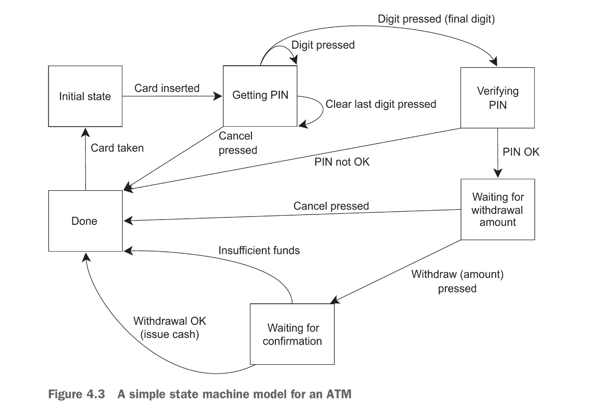

All synchronization features discussed earlier allows us focus on the operations that need synchronizing rather than the mechanics itself.

Concurrency in c++ models the functional programming philosophy in it’s application; Rather than sharing information directly between threads, A task can be packaged with all dependencies it needs, shipped to be executed in a thread then it’s result can be disseminated to any other thread that needs it through the use of futures.

### Functional programming with futures
Function programming is a paradigm of programming in which the result of a function call is solely and only dependent on the arguments passed into it’s parameters, it is not dependent on any external state.

This is related to the mathematical concept of a function. 

As discussed in [earlier](../tour_of_cpp_bjarne/01.%20The%20Basics.md#Pure%20functions) a pure function does not mutate or modify any external state (no side-effects). It’s effects are completely limited to its return value.

This approach of abiding to functional programming makes things easy to think about especially when concurrency is involved and since c++ is a multi-paradigm programming language we can benefit using it’s support for functional code to develop concurrent programs.

Futures are the final piece of the puzzle that makes FP-style concurrency viable in C++; a future can be passed around between threads to allow the result of one computation to depend on the result of another, without any explicit access to shared data.

### FP Style Quick-sort

Sequential implementation of quick sort:
```c++
template <typename T>
std::list<T> sequential_quicksort(std::list<T> input)
{
	if(input.empty())
		return input;
	
	std::list<T> result {};
	result.splice(result.begin(), input, input.begin());
	const T& pivot = *result.begin();
	
	auto division_point = std::partition(input.begin(), input.end(),
		[&](const T& t){ return t<pivot; });
	
	std::list<T> lower_part {};
	lower_part.splice(lower_part.end(), input, input.begin(),
		division_point);
	
	auto new_lower_part( sequential_quicksort(std::move(lower_part)) );
	auto new_higher_part( sequential_quicksort(std::move(input)) );
	
	result.splice(result.begin(), new_lower_part);
	result.splice(result.end(), new_higher_part);
	return result;
}
```

### FP-Style Parallel Quick-sort
Because our prevent implementation uses a functional style already, It would now be easy to convert it into a parallel version using futures; It’s mostly the same just that some operations now run in parallel:
```c++
template <typename T>
std::list<T> parallel_quick_sort(std::list<T> input)
{
	if(input.empty())
		return input;
	
	std::list<T> result;
	result.splice(result.begin(), input, input.begin());
	const T& pivot = *result.begin();
	
	auto division_point = std::partition(input.begin(), input.end(),
		[&](const &T t){ return t<pivot; });
	
	std::list<T> lower_part;
	lower_part.splice(lower_part.end(), input.begin(), division_point);
	
	std::future<std::list<T>> new_lower_part(
		 std::async(&parallel_quick_sort<T>, std::move(lower_part)));
	auto new_higher_part( parallel_quick_sort(std::move(input)) );
	
	result.splice(result.end(), new_higher_part);
	result.splice(result.begin(), new_lower_part.get());
	return result;
}
```
The big change in this version is sorting the lower portion here with `std::async()`, the upper part is still sorted directly with recursion as before. If the library itself decides that there are multiple concurrent task that exceeds the concurrency capability of the hardware;  The library then switches new `async` tasks to run synchronously instead of concurrently. 

It’s worth mentioning that it’s perfectly conforming for `std::async` tasks to execute concurrently (even in the face of massive over-subscription) except when specified otherwise via `std::launch::deferred` , or to run tasks synchronously unless `std::launch::async` is explicitly specified.

If you’re relying on automatic scaling; best consult the documentation for your hardware implementation to see what behaviors should be expected.

### Using a task spawner instead of `std::async`
Rather using `std::async`, we can implement our on wrapper function consisting of an `std::packaged_task` and an`std::thread`, but this won’t offer much utility compared to `std::async` for our previous example (the quick sort program), plus it would mostly likely lead to massive over-subscription. 

However this proceed does pave way for more sophisticated implementations that provide granular control of the concurrency mechanics in a program, implementations like thread pools benefit (and are kinda modeled) by set-ups like this:
```c++
template <typename F, typename A>
std::future<std::result_of(F(A&&))::type> spawn_task(F&& f, A&& a)
{
	typedef std::result_of(F(A&&))::type result_t;
	
	std::packaged_task<result_t (A&&)> task(std::move(f));
	std::future<result_t> res (task.get_future());
	
	std::thread thr (std::move(task), std::move(a)); thr.detach();
	
	return res;
}
```
the task to be computed is packaged into a packaged-task then a reference to it’s result is secured (a future) then the packaged task is shipped into a thread to be executed concurrently, the future referring to the resultant of the newly-shipped task is then returned for whomever required it.

Thread pools will be discussed later.

###  Communicating Sequential Process
FP is not the only programming language that eschews shared mutable data; another paradigm is CSP (Communicating Sequential Process). 

In this paradigm threads are conceptually entirely separate with no shared mutable data but the threading mechanism contain channels that allow threads communicate with each other.

This paradigm is adopted by programming language Erlang and by the MPI (Message Passing Interface, check their official site when needed Felix), this interface is commonly expressed in C and C++, due to it’s high-performance computing capabilities. 

This section describes how to achieve CSP in c++.

### Synchronizing operations with messages passing
The idea of CSP is simple: each thread, when no shared data in involved, can be reasoned independently as it’s sum behavior in response to the messages it receives.

This conceptualizes a thread with this paradigm as, basically,  a state machine; when it receives a message it updates it’s state in some manner (maybes sending one or more messages to other threads), with the processing performed dependent of the initial state.

Programs with this concurrency paradigm due to the eradication of shared data reliance within threads and the isolation of each thread forced inherently to run as their own independent process, this paradigm makes programming easier and reduces the risk of bugs.

True communicating sequential process have no shared data with all messages to be communicated relayed into queues. In C++ it is not inherently possible to enforce this requirement so this is where discipline while designing the structural framework of concurrent programs that (partially) follow this model should come in.

### Modelling an ATM using the Communicating Process Interface
To Illustrate this paradigm we will, simplistically, model an ATM using CPI, The program will need to handle interaction with a user, interaction with the relevant bank and interaction with the physical machinery.

A way to go about this will be to split the program into three independent threads; 
1) A thread that performs The ATM Logic  (a state machine)
2) A thread handling the Physical machinery (a state machine) and,
3) A thread that communicates with the relevant bank (also a state machine)
The threads communicate solely by passing messages with each other, rather than relying on shared data.

The physical machinery thread will pass messages to the ATM logic thread when it intercepts an input; the ATM logic thread passes a message to the thread that handles communication with relevant banks and so forth.

The ATM logic and be modeled as a state machine as thus: In each state, the thread waits for an acceptable message, which it then process, This may result in transitioning to a new state and the cycle continues.

The state machine’s job is to actively execute the duties it’s current state demands; meaning only the thread associated with the current state reserves the right to modify the ATM logic state machine holistically at that moment.



The state machine will be implemented as a class with each of it’s state representations implemented as member functions.
##### Simplified implementation of an ATM logic class 
```c++
struct card_insterted
{
	std::string account;
};

class atm
{
	messaging::reciever incoming;
	messaging::sender bank;
	messaging::sender interface_hardware;
	void atm::*state (); // pointer function to current state
	
	std::string account;
	std::string pin;
	
	void waiting_for_card()
	{
		interface_hardware.send(display_enter_card());
		incoming.wait()
			.handle<card_inserted>(
				[&](card_inserted const& msg)
				{
					account=msg.account;
					pin="";
					interface_hardware.send(display_enter_pin());
					state=&atm::getting_pin;
				}
			);
	}
	void getting_pin();
public:
	void run()
	{
		state=&atm::waiting_for_card;
		try 
		{
			for(;;) 
				(this->*state)();
		}
		catch(messaging::close_queue const&) 
		{}
	}
};
```
This is a grossly simplified state machine for the ATM Logic, implemented modelling CPI.

This illustration gives us a feel of the message passing mechanism in this kind of concurrency paradigm, no need to think about synchronization, just which messages to send and where and which messages may be received. This single component; the ATM Logic; A state machine; runs one a single thread while other components run on their own separate threads. This style of programming is known as the *Actor model*

In the Actor model there are several discrete actors (components, each working on separate threads) which send messages to each other to actualize a system. There is not shared state except that which is directly passed via messages.

In the ATM logic state machine code above, execution starts with the `run()` member function which sets the initial state of the state machine; it then repeatedly executes the member function representing the current state whatever it is. The code is further explained in the text. Each state, when completed, mutates the machine holistically to a new state  which `run()` invariably executes.

##### Below is the `getting_pin` state function for the simple ATM Logic implementation
```c++
void atm::getting_pin()
{
	incoming.wait()
		.handle<digit_pressed>(
			[&](digit_pressed const& msg)
			{
				unsigned const pin_length=4;
				pin+=msg.digit;
				if(pin.length()==pin_length)
				{
					bank.send(verify_pin(account, pin, incoming));
					state=&atm::verifying_pin;
				}
			}
			)
		.handle<clear_last_pressed>(
			[&](clear_last_pressed const& msg)
			{
				if(!pin.empty())
					pin.resize(pin.length()-1);
			}
			)
		.handle<cancel_pressed>(
			[&](cancel_pressed const& msg)
			{
				state=&atm::done_processing;
			}
			);
}
```
Function explains itself but if you later get confused Felix, consult the text.

This style of programming concurrency program greatly simplifies things because each thread can be treated entirely independent from another. it is an example of using multiple threads to separate concerns as such requires one to explicitly decide how to divide the tasks between threads.

### Continuation-style concurrency with the Concurrency TS
The Concurrency TS (whatever that is) provides new versions of `std::promise` and `std::packaged_task` in the `std::experimental` namespace that differ from the `std::` originals.

This new versions enable users take advantage of the new key feature; `std::experimental::future`—*continuations*.

Continuations via experimental futures posses the mechanics that can allow us model a “when this future data is ready, then do this process” behavior in concurrent programs. 

This is done by securing an already ready `std::experimental_future` then invoking it’s`.then()` member function; This invocation receipts a required task to be executed as an argument then executes that task. The executed task sole dependency is the shared data of the future object that performed the *continuation*  via `.then()`.

Given a future `fut`, a continuation is added with the call `fut.then(continuation)`, where `continuation` is the aforementioned task that will be executed.

Just like `std::future`, `std::experimental::future` allows its stored value to be retrieved only once, regardless if a continuation was responsible for retrieving the stored value ergo once a continuation is invoked the future that invoked it now posses no stored data and it’s state becomes invalid, hence in our former example, `fut` after it’s*continuation* becomes `invalid`:
```c++
std::experimental::future<int> find_the_answer(void);
auto fut = find_the_answer();
auto fut2 = fut.then(find_the_question);
assert(!fut.valid());
assert(fut2.valid());
```
Unlike direct calls to `std::async` or `std::thread`, you cannot pass arguments to a continuation function since it’s **only** argument is implicitly the ready future that triggered the continuation hence whatever continuation function object that is passed into `.then()` must be tailored to fit this requirement.

For example, assuming the `find_the_answer`  function returns an `int`; `find_the_question` function must have `std::experimental::future<int>` as it’s only parameter, hence its declaration should be something like:
```c++
std::string find_the_question(std::experimental::future<int> the_answer);
```
The reason for thus is that the future passed on into the continuation may by storing an exception and if the library decides to pass in the stored value rather than the future in it’s entirety; the library would then have to be the one to handle the exception; Passing the future as a whole forces the continuation to handle the exception.

Concurrency TS does not specify an equivalent to `std::async`, writing one though is fairly straightforward:
```c++
template <typenmae Func>
std::experimental::future<decltype(std::declval<Func>()())>
	spawn_task(Func&& func)
{
	std::experimental::promise<decltype(std::declval<Func>()())> p;
	auto res = p.get_future();
	std::thread t (
		[p=std::move(p), f=std::decay_t<Func>(func)] () 
		mutable {
		try {
			p.set_result_at_thread_exit(f());
		}
		catch(...) {
			p.set_exception_at_thread_exit(std::current_exception());
		}
		}
	);
	t.detach();
	return res;
}
```
`std::decay` strips types to their true underlying type; untainted with any qualifiers or reference-ness:
1) if template parameter argument is a an array of type `U` returns type `U*`
2) if template parameter argument is an function type or reference to one: returns type `std::add_pointer<T>::type`; which is just a fancy bare-boned declaration for a pointer to the function type. 
3) Otherwise it returns; `std::remove_cv<std::remove_reference<T>::type>::type` which basically interprets to: if it’s an object type with possibly added constant-ness, volatility and reference attributes, its strips all those attributes off and returns the type in it’s class declared pure state; no modifying type characteristics, so something like `const Obj&&` will decay into `Obj`, where `Obj` is the pure type.

and since `Func` is an function-object but still an object and **NOT** a function type; our case when `f=std::decay_t<Func>(func)` was declared is case 3.

### Chaining continuations
Suppose we have a series of time consuming tasks and we want them performed asynchronously in order free the main thread to perform other tasks; for example a user authentication program, that authenticate retrieve users information and then update the display UI.

This can be achieved sequentially like so:
```c++
void process_login(std::string const& username, std::string const& password)
{
	try {
		user_id const id=backend.authenticate_user(username, password);
		user_data const info_to_display=backend.request_current_info(id);
		update_display(info_to_display);
	} catch(std::exception& e) {
		display_error(e);
	}
}
```
However we don’t want sequential code; we want something asynchronous so the UI thread does not block. 

With plain `std::async` we can just jam the login task to run in some background thread, but this will still cause that background thread to block in-between the individual tasks that make the entirety of the login task. Like so:
```c++
std::future<void> process_login(std::string const& username,
	std::string const& password)
{
	return std::async(std::launch::async, [=](){
		try {
		user_id const id=backend.authenticate_user(username, password);
		user_data const info_to_display=backend.request_current_info(id);
		update_display(info_to_display);
		}
		catch (std::exception& e) {
		display_error(e);
		}
	});
}
```
In order to avoid blocked threads we need a mechanism that chain tasks to the next task immediately they complete; Continuations help us achieve this:
```c++
std::experimental::future<void> process_login (
	std::string const& username, std::string const& password)
{
	return spawn_async([=](){
		return backend.authenticate_user(username, password);
	}).then([](std::experimental::future<user_id> id){
		return backend.request_current_info(id.get());
	}).then([](std::experimental::future<user_data> info){
		try {
			upadate_display(info.get());
		} catch (std::excpetion& err) {
			display_error(err);
		}
	});
}
```
Continuations via `.then()` forward the resultant future of the initial task to the next chained task to “continue” the execution.

Continuation tasks via `.then(task)`, `task` which is a lambda (or function of some sort), must have and only have `std::experimental::future< return_type_of_last_task >`, where `return_type_of_last_task` is well the return type of the last task. 

When a future is relayed to the next chain via `.then()` that chain retrieves that shared data from that future via `.get()` and performs its task.

Although this version of the `process_login` chains and links tasks with each other, thread blocking can still occur if the individual operations like communicating with the back-end blocks internally, so this approach is still not free from thread blocking. 

What we need is for back-end calls to return futures that become ready when the data is ready without blocking the threads. An implementation is declared in the text.

### Waiting for more than one future
In cases where we have large amount of data to process and each of the data can be processed independently.

We to achieve this we could:
1) Spawn each task asynchronously and have another gathering thread on standby that scans each task one by one to retrieve it’s result; waiting when necessary and retrieving immediately when possible. In this case the gathering thread will block whenever it tries to retrieve the result of any unready task it encounters while gathering. This entails the thread regularly goes dormant due to waiting and is awoken whenever it’s wait is over. Once the wait is over; it’s gathering mechanism is then scheduled to execute. This leads to lots of task switching and (also) invariably stances the thread as a hogger of executive resources.
2) Or still spawn each task asynchronously but have another thread that spawns to gather the results of each task when and only when all task are completed and each of their futures are in a collective ready state.
Here is an example of the first scenario:
```c++
std::future<FinalResult> process_data (std::vector<MyData>& vec)
{
	size_t const chunk_size=whatever;
	std::vector<std::future<ChunkResult>> results;
	for(auto begin=results.begin(), end=results.end(); begin!=end;)
	{
		size_t const remaining_size=end-begin;
		size_t const current_chunk=std::min(remaining_size, chunk_size);
		results.push_back(
			spawn_async(process_chunk, begin, begin+current_chunk);
		);
		begin += current_chunk;
	}
	
	return std::async([all_results=std::move(results)](){
		std::vector<ChunkResult> final_result;
		final_result.reserve(all_results.size());
		for(auto res& : all_results)
		{
			// resource-hogging blocks that (potentially) yields
			// excessive task switching happens below
			final_result.push_back(res.get()); // <-- HERE.
		}
		return gather_results(final_resuls);
	});
}
```
The above approach is inefficient and would cause lots of processing overhead; however c++ provides a solution to this problem via `std::experimental::when_all`.

`std::experimental::when_all` takes in a set of futures and returns a new future that becomes ready when all the passed in futures are set as ready, This helps eliminate the issue of task switching and executive-resource-hogging idleness in the gathering thread as it blocks in-between each unready future it encounters while gathering.

Hence with `when_all` we can await numerous futures to become ready and then schedule a gathering function (a continuation) via `.then()`. This is basically the second scenario made possible with `when_all`:
```c++
std::experimental::future<FinalResult> process_data (
	std::vector<MyData>&  data)
{
	size_t const chunk_size=whatever;
	std::vector<std::experimental::future<ChunkResult>> results;
	for(auto begin=results.begiin(), end=results.end(); begin!=end)
	{
		size_t const remaining_size=end-begin;
		size_t const current_size=std::min(chunk_size, remaining_size);
		results.push_back(
			spawn_async(process_chunk, begin, begin+current_size);
		);
		begin+=current_size;
	}
	return std::experimental::when_all(results.begin(), results.end())
		.then([](std::future<std::vector<
			std::experimental::future<ChunkResult>>> f_res)
			{
				auto gotten_results = f_res.get();
				std::vector<ChunkResult> final_results;
				final_results.reserve(gotten_results.size());
				for (auto r& : gotten_results)
					final_results.push_back(r.get()); // no blocking.
				return gather_results(final_results);
			});
}
```
