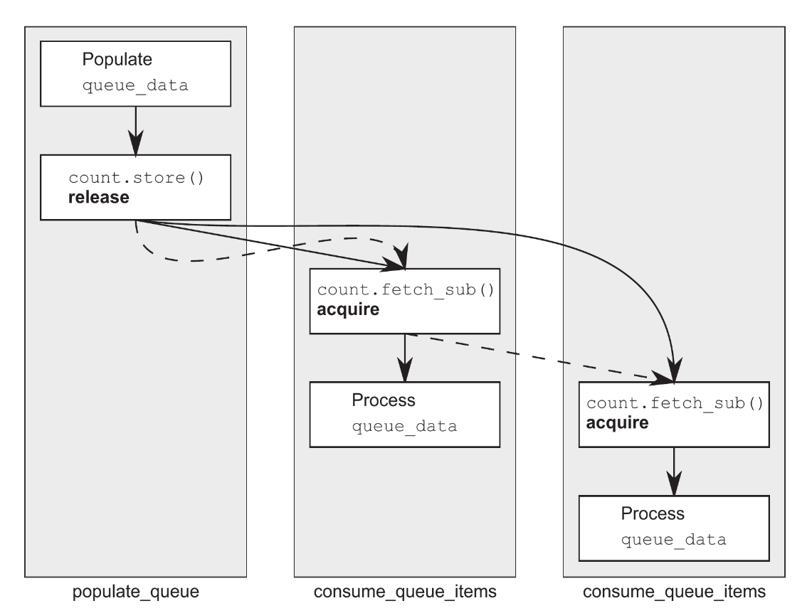

## Atomic Relationships
1) Synchronizes with, and
2) Happens before
### Synchronizes-With relationship 
The idea behind this relationship, basically, is; if an atomic write operation say `W` operates on a variable `x`, any following atomic read synchronizes with the write operation `W` evaluating to the value written by `W`. In the case that a subsequent atomic write is done by the same thread that performed `W` or by a sequence of  `read-write-modify` operations performed by some threads, the first thread in that sequence or that  aforementioned subsequent write, will synchronize with the initial atomic write operation `W`.
### Happens-before
This one is self explanatory; if a statement is declared before another statement, the prior statement executes before the latter and hence happens before the latter.

There are six memory ordering operations that can be applied on atomic types, these are:`memory_order_relaxed`, `memory_order_consume`, `memory_order_acquire`, `memory_order_release`, `memory_order_acq_rel`, and the most stringent of the all; `memory_order_seq_cst`. 

The default memory order for all atomic type is `memory_order_seq_cst`, Though there are six orderings, each fall into one of these three categories:
1) Sequentially consistent ordering; `memory_order_seq_cst` 
2) Acquire release ordering: `memory_order` —> `_consume`, `_acquire`and `_release`
3) Relaxed ordering: `memory_order_relaxed`

These three distinct memory orders can have different costs on different CPU architectures, example was illustrated in the text, the first one is kind of cryptic to me (edit: This is the future, and i understand it now).

The availability of distinct memory models, each with it’s own perks, offer developers the opportunity to develop performance driven programs by selecting the memory-ordering model best suited for their needs.

For example memory ordering models that provide fine grained ordering relationships prove to be useful when highly performative execution is a required trait, compared to sequentially consistent ordering; which is fine for less critical cases.

# Understanding memory orderings

## 1.  Sequentially consistent ordering
This is the default memory ordering, programs that follow this paradigm are consistent with the simple sequential view of the world.

 If all operations on atomic types where consistently sequenced, then the behavior of the multi threaded program will imitate that of operations sequenced in a particular order, executed on a single thread. 

This i the most simplest memory order to understand hence why it’s the default memory order: All threads must see the same order of operations. Since ordering of operations is strictly the same for all threads they cannot be reordered.

### The sequential consistent ordering constraint
A defining constraint sequentially consistent ordering enforce is that any sequentially consistent atomic operations done after a load on a variable must also appear after the store of that variable to other threads, This constraint does not carry over to other atomic operations that rely on a  different memory ordering; All operations, in all threads must rely solely on sequential consistent ordering in order to perceive this constraint.

 Sequentially consistent ordering can be expensive and can sometimes impose performance penalties, although these cons depends on the systems implementation.

```c++
Sequential consistency implies total ordering
#include <atomic>
#include <thread>
#include <assert.h>

std::atomic<bool> x, y;
std::atomic<int> z;

void write_x()
{
	x.store(true, std::memory_order_seq_cst);
}
void write_y()
{
	y.store(true, std::memory_order_seq_cst);
}
void read_x_then_y()
{
	while(!x.load(std::memory_order_seq_cst));
	if(y.load(std::memory_order_seq_cst))
		++z;
}
void read_y_then_x()
{
	while(!y.load(std::memory_order_seq_cst));
	if(x.load(std::memory_order_seq_cst))
		++z;
}
int main()
{
	x=false; y=false; z=0;
	
	std::thread a (write_x);
	std::thread b (write_y);
	std::thread c (read_x_then_y);
	std::thread d (read_y_then_x);
	
	a.join(); b.join(); c.join(); b.join();
	
	assert(z.load()!=0);
}
```
In the above example `assert` can never fire; because either x or y will be stored first, and its sequentially consistent that z must be incremented as any of the read function executes. The `join()` invocations before the asserts ensures the main thread waits for it’s spawned threads to return before asserting. Due to the symmetric nature of this concurrent program, thanks to sequentially consistent ordering;  z could be 1 (if one of the read functions return false) or 2 (if both read functions return true) but  **never**  zero.

Sequential ordering is the most straight forward and intuitive ordering but also the most expensive memory ordering due to the cost that comes with globally synchronizing all threads.

## 2. Non-Sequentially consistent memory orderings
Once we venture out of the predictably comfortable world that is sequentially-consistent ordering, things start to get complicated.

The gripe that comes with venturing out of sequentially-consistent ordering is the absence of a *single global sequence of operations*, Meaning different threads can see different views of the same operation at the same time (i think at the same time). 

In this realm, things start to act *truly* concurrent with one another. Not only do we have to account for that but we now see that; threads *do not have to agree* on the order of events or operation while executing. This is a quintessential ideology we have to come into terms with in order to understand any code that uses a memory ordering other than`memory_order_seq_cst`.

This disagreement between and within threads on the ordering of events (especially when an explicit ordering constraint is absent) is due to internal caches and buffers holding different values for the same memory. So it’s important from here on out to understand that *threads do not have to agree on the order of events*.

Not only do we  have to throw out mental models based on interleaving operations, we also have to throw out mental models based on the idea of the compiler or processor reordering instructions. In the absence of other ordering constraints, *the only requirement* is that all threads **agree on the modification order of each individual variable**.

### Relaxed Ordering
Operations on atomic types following relaxed ordering do not participate in synchronizes-with relationships But operations on the same variable within a single thread still obey happens-before relationship.

There’s almost no requirement on ordering relative to other threads. 

The only requirement is that accesses of an atomic variable within the same thread cannot be re-ordered; once a given thread has seen a particular value of an atomic variable, subsequent reads (by that thread) to that variable cannot retrieve an earlier value.

Without any additional synchronization, the modification order of each variable is the only thing shared between threads using `memory_order_relaxed`.

The text beautifully explains Relaxed Ordering so if still confused with the example, read the subsection `Understanding Relaxed Ordering`.

Relaxed atomic operations are difficult to deal with and must be used in combination with atomic operations that feature stronger ordering semantics in order to be useful in inter-thread synchronization. They should be used only when necessary and with extreme caution.

### Acquire-Release Ordering
This ordering offers additional synchronization without the overhead of a full blown sequential consistency.

Under this ordering model:
1) Atomic loads are *acquire* operations (`memory_order_acquire`) 
2) Atomic stores are *release* operations (`memory_order_release`) and,
3) Atomic read-modify-write operations like `fetch_add()`or `exchange()`are either *acquire, release* or both (`memory_order_acq_rel`)

Synchronization is pairwise between the thread that does the release and the thread that does the acquire.

*A release operation synchronizes with an acquire operation that reads the value written*.
Meaning.. different threads can still see different orderings, but this orderings are somewhat restricted.

Things to not about acquire release semantics:
1) Acquire-release doesn’t imply a total order (This was illustrated in `listing 5.7`)
2) Acquire-release operations can impose an ordering on relaxed operations, An illustration is given below
```c++
#include <atomic>
#include <thread>
#include <assert.h>

std::atomic<bool> x, y;
std::atomic<int> z;

void write_x_then_y()
{
	x.store(true, std::memory_order_relaxed);
	y.store(true, std::memory_order_release);
}
void read_y_then_x()
{
	while(!y.load(std::memory_order_acquire));
	if(x.load(std::memory_order_relaxed))
		++z;
}
int main()
{
	x=false;
	y=false;
	z=0;
	std::thread a {write_x_then_y};
	std::thread b {read_y_then_x};
	a.join(); b.join();
	assert(z.load()!=0); // The assert
}
```
Due to the synchronizes-with relationship between the acquire-load of `y` and the release-store of `y`  paired with the happens-before relationship between the the stores to `x` and the store to `y` ;  The assert can never fire.

Inter-thread happens before is transitive; meaning if A inter-thread happens before B and B inter-thread happens before C, correspondingly, A inter-thread happens-before C. Meaning; acquire-release ordering can be used to synchronize data across several threads, even when the intermediate threads do not touch the data.

### Transitive Synchronization using acquire and release ordering
The release memory order symbolically represents a batch of operations to be released for acquisition, once a acquire memory order synchronizes with this release, the batch can be acquired and the released memory can then be utilized by the thread that performed the acquisition. 

This synchronization is transitive to the subsequent threads that partake in further release and acquisition of this batch of memory; this transitive behavior between multiple threads is known as a **release sequence** 

Below is an example that shows the transitively synchronizing nature of acquire and release ordering:
```c++
std::atomic<int> data[5];
std::atomic<bool> sync1(false), sync2(false);

void thread_1()
{
	data[0].store(42, std::memory_order_relaxed);
	data[1].store(97, std::memory_order_relaxed);
	data[2].store(17, std::memory_order_relaxed);
	data[3].store(-141, std::memory_order_relaxed);
	data[4].store(2003, std::memory_order_relaxed);
	// the below release, releases the above batch of memory
	// for acquisition
	sync1.store(true, std::memory_order_release);
}

void thread_2()
{
	// acquisition is ongoing
	while(!sync1.load(std::memory_order_acquire));
	// acquisition successful, batch of memore visible and acquired.
	
	// release semantics below, releases the just acquired batch
	// for subsequent acquisition by another aqcuire sematics.
	sync2.store(true, std::memory_order_release); 
}

void thread_3()
{
	// acquisition ongoing
	while(!sync2.load(std::memory_order_acquire));
	// acquisition successful, batch of memory from thread_1
	// is now visible
	assert(data[0].load(std::memory_order_relaxed == 42));
	assert(data[1].load(std::memory_order_relaxed == 97));
	assert(data[2].load(std::memory_order_relaxed == 17));
	assert(data[3].load(std::memory_order_relaxed == -141));
	assert(data[4].load(std::memory_order_relaxed == 2003));
	// asserts cannot and will not fire.
}
```
The comment in the above example explains the code, if confused; consult the text.

It should be mentioned that `sync1` and `sync2` in `thread_3` can be merged into a single variable by using a read-modify-write operation with `memory_order_acq_rel`; This memory order embodies the semantics of an acquire and release memory order, both, as a single ordering of memory, An example illustrating this:
```c++
std::atomic<int> sync(0);

void thread_1()
{
	//..
	sync.store(1, std::memory_order_release);
}
void thread_2()
{
	int expected=1;
	
	while(
	!sync.compare_exchange_strong(expected, 2, std::memory_acq_rel)
	)
		expected=1;
}
void thread_3()
{
	while(sync.load(std::memory_order_acquire) < 2);
	//..
}
```

It should be noted that read-modify-write operations should be tagged with `std::memory_order_acq_rel` if we want to achieve a synchronize-with relationship with some prior release/some subsequent acquire operation.

It should be noted that read-modify-write operations are **not** read operations neither are they write operations; They are are exclusively and uniquely read-modify-write operations, so using `memory_order_acquire` or `memory_order_release` orders on them does not perform any synchronizes-with execution.

If you mix acquire-release operation with sequentially consistent operations, the sequentially consistent loads behave following acquire semantics and the sequentially consistent stores behave following release semantics, the corresponding logic follows for sequentially consistent read-modify-write operations.

Relaxed operations are still relaxed but bound by the additional synchronized with and consequent happens-before relationships introduced through the use of acquire-release semantics.

### Data dependency with acquire release ordering and `memory_order_consume`

`memory_order_consume` is a dependency driven/oriented variant of `memory_order_acquire`. It,  basically, only cares about enforcing that the dependencies of the operation it was declared upon is visible at all times to that operation.

C++17 standard explicitly recommends that is should not be used, Hence it’s only covered here for the sake of the completeness of this subject matter.

Data dependency is a straight forward concept: if the resultant of operation A is used as an operand for the execution of operation B then it follows that operation B is dependent on A, in this scenario it can also be said that A ***carries-a-dependency-to*** B. The nuances of the vehicular structure A uses to carry its dependency unto B is irrelevant, as long as the dependency was successfully transported (meaning it could be through a variable or some shit idk).

The ***carries-a-dependency-to*** relationship is transitive; meaning if A carries a dependency to B, and B does the same to C, holistically; A carries a dependency to C.

A ***dependency-ordered-before*** relationship can apply between threads; and it is introduced with load operations tagged with `memore_order_consumed`.
`memory_order_consumed` is a special case of `memore_order_acquire` that limits the synchronized data to its direct dependencies.

A store operation A tagged with memory order, `release`, `acq_rel` or `seq_cst` is dependency-ordered-before a load operation B tagged with `memory_order_consume` of the consume reads the values stored. In This synchronization only the memory (variable/object) operated on and its dependencies, synchronize, The rest are inconsequential.

An example illustrating consume:
```c++
struct X 
{
	int i;
	std::string s;
};

std::atomic<X*> p;
std::atomic<int> a;

void create_x()
{
	X* x = new X;
	x->i = 42;
	x->s = "hello";
	a.store(99, std::memory_order_relaxed); // statement 1
	p.store(x, std::memore_order_release); // statement 2
}
void use_x()
{
	X* x;
	while( !(x=p.load(std::memory_order_consume)) ) // statement 3
		std::this_thread::sleep(std::chrono::microseconfs(1));
	assert(x->1==42); //statement 4
	assert(x->s=="hello"); //statement 5
	assert(a.load(std::memory_order_relaxed)==99); // statement 6
}
```
In this code we can see that the statement 1 is inconsequential despite there being a noticeable happens before relationship with the release-store at `p` (statement 2) that was consumed by the load in `use_x` (statement 3); hence the loading of `p` will synchronize flawlessly with all it’s dependencies successfully ordered before said loading, making the asserts related to `x` (statement 4 and 5) incapable of firing, But, as mentioned before, since consumes only care about making the making the dependencies of the object it consumed synchronized while loading, assert on `a` can fire if the program wills it (statement 6).

In real code we should always use `memory_order_acquire` wherever we might be tempted to use `memory_order_consume`.

# Further Notes on the Synchronization Mechanisms Atomics possess

### Release Sequence
If a store is tagged is with `memory_order_release`, `memory_order_acq_rel`, `memory_order_seq_cst` and the load is tagged with `memory_order_consume`, `memory_order_seq_cst` and each operation in the chain loads the value written in the previous operation, the chain of operations constitutes a ***release sequence***, And the initial store synchronizes with (for `_acquire` or `_seq_cst`) or is dependency-ordered-before (for `_consume`) the final load.

Any read-modify-write operations in the chain an have any memory ordering (even `memory_order_relaxed`).

Below is an example that reads values from a queue with atomic operations
```c++
#include <atomic>
#include <thread>

std::vector<int> queue_data;
std::atomic<int> count;

void populate_queue()
{
	unsigned const number_of_items=20;
	queue_data.clear()
	for (unsigned i=0; i<number_of_items; ++i)
		queue_data.push_back(i);
	count.store(number_of_items, std::memory_order_release);
}
void consume_queue_items()
{
	while(true)
	{
		int item_index;
		
		using acquire = std::memory_order_acquire;
		if ( (item_index=count.fetch_sub(1, acquire))<=0 )
		{
			wait_for_more_items();
			continue;
		}
		process(queue_data[item_index-1]);
	}
}
int main()
{
	std::thread a (populate_queue);
	std::thread b (consume_queue_items);
	std::thread c (consume_queue_items);
	a.join(); b.join(); c.join();
}
```
In this case where there are 2 consumer threads , the second `fetch_sub()` will see the value written by the first and not the value written by the `store`. Without the rule of the release sequence the second thread wouldn’t have a happens-before relationship with the first thread. This code is further explained in the text.

Basically there can be any number of links in the chain (like the example above), but provided they’re all read-modify-write operations such as `fetch_sub`, the release-store will still synchronize with each one that’s tagged `memory_order_acquire`, and still impose a (relative) happens-before relationship with all read-modify-write operations where due.

For the previous example, The image below shows the shows the relatively imposed happens-before relationship between the `store()` and the consumer threads read-modify-write operations tagged with `_acquire` with solid lines and the release sequence relationships shared by them all with dotted lines:



### Fences
Fences are operations that enforce memory-ordering constraints without modifying any data and are typically combined with atomic operations that use the `memory_order_relaxed` ordering constraint.

Fences are global operations and affect the ordering of other atomic operations in the threads that executed the fence, They are also called *memory barriers*, they are called this because they place a line a code that certain operations cannot cross.

They are usually used to enforce happens-before and synchronizes-with relationships in situations where they weren’t present in before. This can come in handy when dealing with relaxed operations

```c++
#include <atomic>
#include <thread>
#include <assert.h>

std::atomic<bool> x, y;
std::atomic<int> z;

void write_x_then_y()
{
	x.store(true, std::memory_order_relaxed);
	std::atomic_thread_fence(std::memory_order_release);
	y.store(true, std::memory_order_relaxed);
}
void ready_then_x()
{
	while(!y.load(std::memory_order_relaxed));
	std::atomic_thread_fence(std::memory_order_acquire);
	if(x.load(std::memory_order_relaxed))
		++z;
}
int main()
{
	x=false; y=false; z=0;
	
	std::thread a (write_x_then_y);
	std::thread b (read_y_then_x);
	a.join(); b.join();
	
	assert(z.load()!=0);
}
```
It should be noted that both fences are necessary: you need a release in one thread and an acquire in another to get a synchronizes with relationship.

This is the general idea with fences: if an acquire operation sees the result of a store that takes place after a release fence, the fence synchronizes with that acquire operation; and if a load that takes place before an acquire fence sees the result of a release operation, the release operation synchronizes with the acquire fence. You can have fences on both sides.

It should be noted that the synchronization point is the fence itself, without placing it in-between the operations we want to order, the ordering can no longer be guaranteed.